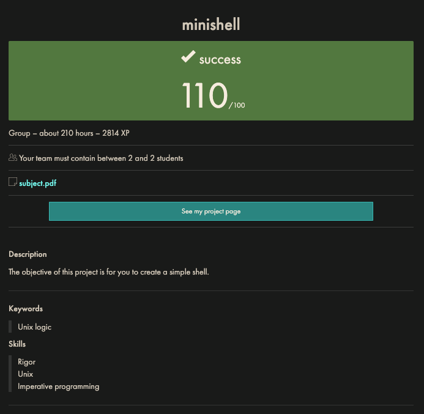

# 42-minishell



- [INTRODUCTION](#introduction)
- [Installation](#installation)
- [Usage](#usage)
- [IMPLEMENTATION](#implementation)
  - [High Level Overview](#high-level-overview)
  - [Initialisation](#initialisation)
  - [Getting Input from the User](#getting-input-from-the-user)
  - [Handling Input](#handling-input)
  - [Tokenisation/Lexing](#tokenisationlexing)
  - [Expansion](#expansion)
  - [Parsing](#parsing)
  - [Heredocs](#heredocs)
  - [Execution](#execution)
  - [Clean-Up](#clean-up)
  - [Signals](#signals)
  - [Structs](#structs)
  - [Minishell Grammar](#minishell-grammar)
  - [Minishell AST Rules](#minishell-ast-rules)
  - [Execution: Further](#execution-further)
  - [Heredocs: Further](#heredocs-further)
  - [Working In a Team](#working-in-a-team)
  - [Ideas/Style guide](#ideasstyle-guide)
- [RESEARCH](#research)
  - [Hierarchy](#hierarchy)
  - [Parsing: Research](#parsing-research)
  - [Grammar](#grammar)
  - [Functions](#functions)
  - [Bash/Minishell Parsing Rules](#bashminishell-parsing-rules)
  - [$ Environment Variables](#-environment-variables)
  - [Expansion: Research](#expansion-research)
  - [Abstract Syntax Tree](#abstract-syntax-tree)
- [Features Not Implemented](#features-not-implemented)
- [Resources](#resources)

## INTRODUCTION

A stripped down implementation of a shell with the following features:

- Pipes
- Redirects
- Here documents
- Variable expansion
- Single and double quoted behaviour
- Wildcards in the current directory

Any references made to standard behaviour refers to `GNU bash version 5.1.16` and most `Minishell` functionality will try to replicate its behaviour.

## Installation

Git clone the repository:

```shell
git clone https://github.com/TimHopg/42-Minishell.git
```

Run `make` from within the directory.

`make clean` will remove object files.

`make fclean` will remove program and object files.

## Usage

```shell
./minshell
```

`Minishell` takes no arguments.

Developed and tested on Linux AMD64 (`x86_64`).  
Dependencies:

- linux-vdso.so.1 (0x00007ffc13f9d000)
- libreadline.so.8 => /lib/x86_64-linux-gnu/libreadline.so.8 (0x00007f90411ee000)
- libc.so.6 => /lib/x86_64-linux-gnu/libc.so.6 (0x00007f9040fc5000)
- libtinfo.so.6 => /lib/x86_64-linux-gnu/libtinfo.so.6 (0x00007f9040f93000)
- /lib64/ld-linux-x86-64.so.2 (0x00007f904125a000)

## IMPLEMENTATION

### High Level Overview

Minishell program can be divided into 6 steps

1) Initialise the main struct (`msdata`)
2) Get the input from user
3) Tokenise and parse user input
4) Handle heredocs
5) Execute commands
6) Free heap allocated resources and go back to step 2

Since step 6 returns to step 2, Minishell runs in an infinite loop. The only way to stop the program is by inputting an `EOF` (`Ctrl+D` from keyboard) or by using the builtin fuction `exit` (more about how exit works in the section [Builtins](#builtins)).

### Initialisation

The first step is to setup the main struct of the program in which the program runs.  
The `init_shell` function takes care of this, by making a copy of the current environment, in this process if there's no environment Minishell automatically creates 3 variables and adds them into the environment. These variables are:

- `PWD` (set to the current working directory)
- `OLDPWD` (set to `NULL`)
- `PATH` (set to `/usr/local/bin:/usr/bin:/bin`)
  - used to search for critical executables

Bash actually handles this slightly differently. If you check `export` or `env` after running bash with `env -i bash` you will see that there is in fact no `PATH` set. Bash handles this with a local variable, not visible to the user which is only unset when a user explicity inputs `unset PATH`. But for our purposes, setting the default `PATH` is sufficient and acheives the same functionality.

After copying the shell environment, the last step is to set up the `SHLVL` variable (See [Shell Level Variable](#shell-level-variable))

Before getting user input, a check is performed in order to determine whether the input will arrive from a terminal (TTY (teletypewriter)) (in which case the shell is said to be in interactive mode) or from a different file descriptor. To do this we use the function `isatty(int fd)`, which takes only one parameter: the file descriptor of the file for which we want to determine if it is a terminal.

By calling `isatty(STDIN_FILENO)`, we decide how to handle user input.

### Getting Input from the User

- If FD is not a terminal
The function `get_next_line` is called to process the file 1 line at the time, when the `EOF` is encountered, `get_next_line` returns 0 and the loop stops. Minishell stops processing the input and exits with the exit code equal to the exit code of the last process run (see [Exit code](#exit-code)).

- If FD is a terminal
The function `readline` is called to get the input from the user, the program runs in a `while(true)` loop and stops only when the user send an `EOF` (`Ctrl+D`) or types exit as input.  

It is important to remember that both `get_next_line` and `readline` return the input without the newline (`\n`). character.

For the rest of the description we assume that Minishell is running in interactive mode, but most information still applies to the case where we are reading from a file.

After having received the user input, the function `process_user_input` is called and we can tokenise.

### Handling Input

The first thing consider is checking what input the user has given us, there are 3 possible cases:

a) input ==  NULL
This means that the user inputted the EOF character, we call `exit_the_shell` function which clears all the heap allocated resources, and exits with `msdata->last_exit` value.

b) input[0] == 0
This means that the user only inputted a `\n` character as input (remember that `readline` removes the last `\n` character). In this case, there's no input to process, we can display the prompt again and wait for more input from the user.  
(We also check if the user has typed only spaces. In this case we also don't process anything and just display the prompt again.)

c) input contains at least one character that is not a space (thank you user!)
We can call the function `add_history` (see [Readline](#readline)) to make sure that the input is added to Minishell's history.

### Tokenisation/Lexing

The first part of handling user input is splitting the input into tokens, a process also referred to as tokenisation. In this process we make sure that every part of the input is accurately divide and correctly labelled.

Keep in mind that some tokens may have to be joined after being split (what?!), for example if you type `l""s` or `"l"s` on bash it will run the command ls. This may or may not be important based on how you choose to tokenise, but for sure is one of those things that you'd prefer to know about before starting the project.

The use of a finite state machine is the optimal method for tokenising a string for shell input. This means only one state of the machine can be active at any one time. This is to say, when you scan a string, as you encounter quotation marks or metacharacters, the state of the machine changes and the appropriate token label also changes.

[medium.com: FSM](https://medium.com/@mlbors/what-is-a-finite-state-machine-6d8dec727e2c#:~:text=A%20Finite%20State%20Machine%2C%20or,artificial%20intelligence%2C%20games%20or%20linguistics.)

#### Double Quotes

Allow for variable expansion and command substitution but prevent word splitting and interpretation of special characters (except `$`, and `\`). We only need to worry about `$` (an env variable) in Minishell.  
  
Without a space before the quotes, the shell interprets the word before and after the quotes as one token.  
  
E.g. `echo abc"def"` outputs `abcdef`, any spaces inside the quotes would also be preserved.  
  
`set -- abc"def"; echo $#` outputs `1`  
`set -- abc "def"; echo $#` outputs `2`  
  
`set --` reassigns positional parameters `$1 $2` etc. to each token.  
`echo $#` prints the number of assigned positional parameters i.e. tokens  
  
`set -- abc "def ghi"; echo $#` outputs `2`  
  
#### Single Quotes  

Single quotes prevent all special character interpretation.

#### Expansion

Once the tokens are created, the next step is the expansion of variables (see [Environment Variables](#-environment-variables)). Then single and double quotes (that are not themselves quoted) are removed from the token.

For example the token:
`"$PWD'42"` becomes `/home/'42`
(the single quote is not removed in this case because it is inside the double quotes. A little tricky but at some point starts to make sense).

#### Parsing

The output from the tokeniser is a single ordered linked list which is received by the parser. The role of the parser is to create a structure that can be interpreted and executed by the program.

Our choice of structure was a binary Abstract Syntax Tree (AST). This approach gives the most flexibility to add rules further down the line should you want to include features from the bonus section.

Recursively, the parser traverses the linked list of tokens and has a rule for when it encounters each type of token. It will automatically build a tree that can be read from the top down, from left to right to execute. As the parser consumes tokens, it also checks for lexicographical/syntactic sense, according to the rules of the grammar. If any tokens remain after parsing, the input does not adhere to the rules of the grammar and an exception should be thrown.

(see [AST rules](#minishell-ast-rules)).

### Heredocs

If parsing has completed and no errors have been found, Minishell will next handle heredocs before any execution can take place. Heredocs are declared with the `<<` operator, what comes after the `<<` is called the `hereend` or delimiter of the heredoc.

Heredocs in Minishell are nothing more than an input redirection. This means that Minishell creates a temporary file for each heredoc encountered in the `tmp` folder which can then be read from. After the heredoc has been read and stored, the heredoc node tunrs into an input redirection node.  
So our parsing tree might look like this:

Before handling:  
`<<HEREEND` (heredoc node)
After handling:  
`<tmp/heredocfile` (input redirection node)

Heredocs are handled with the `readline` function (for signal and simplicity reasons, see [Signals](#signals)).

2 important features of heredocs:

1) Their quantity
You can have a maximum of 16 heredocs per input. If you try to input more, bash will exit with exit status 2 and the appropriate error message will be displayed. Other shells handle more heredocs but we are tasked with replicating bash behavior.

2) Their delimiter
Heredocs also run in an infinite loop. This means you can input continuously (memory permitting) until the exact delimter phrase is entered. This tells Minishell that the user has finished with their input.

#### Heredoc Example

For example in the following heredoc:

`<<hereend` (`heredoc` is the delimiter)

- You can stop the heredoc by typing `hereend`.
- Another way to stop the heredoc is by sending an `EOF` with `Ctrl+D` which also stops the heredoc loop but will make Minishell (and of course bash) print a warning on screen.
- Heredocs ignore the `Ctrl+\` signal and stop execution if `Ctrl+C` is received. (See [Signals](#signals)).
- Heredocs also expand variables, so $HOME should be expanded, _UNLESS_ the delimiter contains single/double quotes. i.e. With `<<here'end'` or `<< here"end"`, the variable `$HOME` would remain as it is and will not be expanded.

### Execution

Once heredocs are handled it's time to execute commands. The function `traverse_tree` moves through the AST created during the parsing step and calls the relevant handler, depending on which type of node is encountered.

There are 4 possibilities:

1) Node is a PIPELINE
To handle pipeline correctly the function `pipe(int fd[2])` is called. This function is a standard C library function which creates a unidirectional data channel to allow two processes to communicate with each other.  
Immediately after a PIPELINE, we must traverse the left side of the tree (where the first command to run will be) and then we traverse the right side.

2) Node is a I/O Redirection  

    To handle input/output redirection we first save the fd of the redirection into the main struct (see [Structs](#structs)).
    - I/O redirections can be single or multiple, so `>outfile` is valid but `>outfile1>outfile2>outfile3` is also valid. In case there are multiple redirections the files are opened one by one using `open()`, but only the last one will be used for redirecting input/output. (Of course it is important to close all file descriptors that are not used with `close(int fd)`).

3) Node is a CMD_NAME

    We've finally arrived at the enginehouse of Minishell, the part of the program that executes. Before executing a command, we inspect everything that is on its right to make sure that input and output redirections are handled (if an error occurs during the i/o redirection step the command is not executed). Once redirections are setup we can execute the command.  

    There are two types of command:

    1) Builtin Commands

        A command that is implemented within Minishell itself, does not required calling another executable because the source code is inside Minishell.

    2) Non-builtin (external) Commands

        A command that we did not implement, requires calling `execve()` to be executed.

        - Handling builtins are easier since they are exist inside the program. We call `ft_strncmp` to see which builtin the command is and then call the appropriate function. Non-builtins require forking to be executed, whereas builtins (ordinarily) do not.

        - To execute a binary file there are several functions that can be used, but Minishell project rules state only `execve` is allowed (probably because it is a syscall). When calling `execve`, the calling process will be REPLACED by the new process. We cannot, therefore, call `execve` from our main Minishell process because it would make Minishell vanish into the void. Since we would like to keep Minishell alive, we must create a duplicate of our process by calling the `fork()` function and in the resulting child process, call `execve`.

4) Node is a COMMAND  

    Based on our grammar (See [Minishell Grammar](#minishell-grammar)), a Command can be thought of as any actionable input on the command line separate by a pipe or the beginning or end of the command. Commands like `cat` or `ls` of course fall into this category but I/O redirections do as well. If we encounter a `COMMAND` node we inspect the left node of the tree to see what action has to be taken. If we find an I/O Redirection node we go back to point 2, if the left node is instead a `COMMAND_NAME` node we go to point 3.

    The fundamental step that occurs in this section is the forking step. What we do is check if we need to fork (if we are inside a pipeline/the command is not a builtin) and react accordingly.

    Once we finish traversing the tree we can call the function `wait_and_update_exit()` to make sure that all child processes return. The easiest way to achieve this is by calling `waitpid` in a loop.  
    `waitpid` is useful because it returns the pid of the process that exited and returns `-1` when there are no other process to wait for. Since we also stored the pid of the last process created we can compare the returning id with the `last_pid` to make sure we save the exit value of the last process created.

#### cat | ls

A newline alone isn't considered `EOF`.  
What's really happening is that when you press return in this pipeline, the newline is causing the line buffering mechanism to flush input through the pipe. In a terminal, `cat` is still running and waiting for more input, but what's different in a pipeline is that pressing return is also causing the PIPE to be closed from the writing end when nothing is reading from the other end.
When `ls` completes (which is immediately), it closes its end of the pipe. Then when you press return, the pipeline detects this closed read end and triggers a `SIGPIPE` to the cat process, causing it to terminate.

So it's not that newline is being treated as EOF - rather, the newline is triggering the buffer flush that exposes the fact that nothing is reading from the pipe anymore, which then causes cat to receive SIGPIPE and exit.

This is why multiple cats in a pipeline need multiple returns - each cat needs to encounter this pipe closure situation separately as the signal propagates through the chain.

##### Pipe Buffering

Each pipe has a fixed buffer size, typically 64KB.  
Utilities like `cat` are _block-buffered_ when connected to a pipe and _line-buffered_ when connected to a terminal.  
This means that when `cat` is used in a pipe, data is buffered until either the buffer fills up or a flush is explicitly triggered (like when pressing return).

##### SIGPIPE

When a process tries to write to a pipe but no process is reading on the other end (the read end is closed), the kernel sends `SIGPIPE` to the writing process. This prevents processes from endlessly writing data that nothing will read.

This is a safety mechanism to prevent deadlocks and wasted resources in Unix pipelines.  

So `ls` runs and exits immediately, closing the read end of the pipe.  
`cat` is still running waiting for input. When anything is inputted, the buffer flushes, `cat` tries to write to the pipe which is closed on the read end. _The kernel_ sends `SIGPIPE` to `cat` and `cat` closes.

#### Clean-Up

To run, Minishell has to allocate resources on the heap and to avoid memory leaks, we need to free them. We free the token list and the parse tree, we also unlink all the temporary heredoc files since they are no longer needed. After this step we reset the default values of the `msdata` struct that may have been modified during the processing of user input (`in_fd`/`out_fd` etc..) and close file descriptors that don't need to stay open anymore.

After clean-up, we return to [the input step](#getting-input-from-the-user) and the loop begins again.

### Signals

Given their parallel nature, signals deserve special section.

To handle signals in Minishell we make use of a single global variable.

`sig_atomic_t sig_received`

`sig_atomic_t` is a special variable type used by signal handlers that ensure read and write happen simultaneously or 'atomically'. If a set of instructions regarding this variable arrives to the CPU all of them are executed without the possibility of getting interrupted.  

Suppose we have `sig_received = 0`, to make this operation the CPU would have to do something like:

- load the value of sig_received register
- mov 0 into a temporary register
- mov the value of the temporary register into the sig_received register

(Take this example with a pinch of salt, it is merely to demonstrate why the atomic concept is so important)

By making these instructions atomic we are sure that the CPU will not do anything else while executing them and avoid problems encountered by data races.

Atomical instructions are relevant in every multithread context and in general in every situation where your program is not being executed 'one line at the time'. In our case it is relevant because when we modify the signal value, we want to be sure that nothing else can modify the same value concurrently.

On this project two are the main signals that we have to handle :

- `SIGINT`  (`Ctrl+C`)
- `SIGQUIT` (`Ctrl+\`)

It is also important to remember that signals are handled in a different way while waiting for input and after having received input so we'll split the two.

- While waiting for user input:

  `Ctrl+C` prints a `^C` followed by a new line on the terminal

  In this project we use `signal()` to handle signals received, mainly because we only need the handlers to store the value of the signal received inside the global var `signal_received`. To store the value of the signal we want to handle we can call `signal(SIGNUM, *signal_handler)`, where `SIGNUM` is the number of the signal that we want to deal with.  

  In this case `SIGINT`(== 2) and then `*signal_handler` is a pointer to the function that takes care of this signal.  

  In our case the function looks like this:
  
  ```C
  void signal_handler(int signum)
  {
    sig_received = signum;
  }
  ```

  Nothing fancy, just take the signal and store it in the global variable. This way we achieve thread-safeness and make sure that output on the screen does not get mixed up.

  But to print something on screen we need one more tool which comes from the `readline` library. There's a special `readline` variable, `rl_signal_event_hook`.  
  You can assign to this variable, a pointer to a function that you define. `readline` will then call periodically this function while waiting for input from the user.

Our implementation is the following :

```C
int    ft_event_hook(void)
{
  if (sig_received == SIGINT)
  {
    ft_dprintf(STDOUT_FILENO, "\n");
    rl_replace_line("", 0);
    rl_on_new_line();
    rl_redisplay();
    sig_received = 130;
  }
  return (0);
}
```

If our handler changed the value of `sig_received` to `SIGINT`, we know that the user (or another process) sent a `Ctrl+C` to our program. `readline` takes care of printing the `^C` on the terminal (we must add the `\n` char and display the prompt again on the new line). We modify `sig_received` to `130` to remember that we have received a `SIGINT` signal.

#### `Ctrl+\` is ignored

`signal(SIGQUIT, SIG_IGN)`

- After receiving user input

  We set Minishell to ignore also `Ctrl+C`  
  `signal(SIGINT, SIG_IGN)`  
  `Ctrl+C` quits all the running processes and prints on screen `^C` followed by a newline.

  In `wait_and_update_exit`, we call the macro, `WIFSIGNALED`. You can pass to it the exit value of the child process, this returns `true` if the child exited because it received a signal.  
  We compare the value of the `exit_status` of the children. If they exit with a value of 2 it means they received a `Ctrl+C` signal.

#### `Ctrl+\` prints `\^Quit (core dumped)`

In `wait_and_update_exit`, after calling `WIFSIGNALED`, we check if `exit_status == 3`. We know that the children exited because it received a `SIGQUIT` so we print on screen `^Quit (core dumped)`.

#### Notes on Signals

Signals in heredoc behave like this :

- `SIGQUIT` is ignored as well (sorry `SIGQUIT` you are not important for us)
- `SIGINT` stops the execution of the heredoc

  In heredocs since we are using `readline`, we can take advantage of the tools it has to offer. For example, what we can do is use `rl_signal_event_hook`, but this time the function looks like this:

  ```C
  int ft_readline_heredoc_hook(void)
  {
    if (sig_received == SIGINT)
      rl_done = 1;
    return (0);
  }
  ```
  
  `rl_done` is another global variable that is found inside the `readline` library and is used to signal that readline is done reading the input from the user. Setting this variable to 1 will make `readline` redisplay the prompt. It is important to remember that if you have multiple heredocs `Ctrl+C` stops all of them and not only the one that you are currently handling.

### Structs

`msdata`:  
Is the main struct, the core of the program. All the relevant information is stored inside this struct.

- `bool is_interactive`  
A boolean value that is determined at startup and determines how Minishell behaves

- `bool is_pipe`  
A boolean value that is passed to the child processes, to know that they are children (you can't use `getppid` in this project).

- `bool is_last`  
A boolean value that is set to true when the last child process is created, this will be relevant for storing the last_exit value.

- `int last_exit`  
The exit value of the _LAST_ program run. This means that if you run `cat | cat | ls` and when `cat` is waiting for input you send a `Ctrl+C` signal, `last_exit` is `0` (exit value of ls) even though `cat` stopped executing after `ls`.

- `int line_num`  
An internal value that bash keeps for various purposes. The one that is used in Minishell is to create the warning message of the heredoc (see [heredoc example](#heredoc-example)).

- `int in_fd`  
The file descriptor of the file from which the program should take the input.

- `int out_fd`
The file descriptor of the file to which the program should write the output.

- `int pipe_fd[2]`  
The array of file descriptors that will be passed to the pipe function to create the channel for the piped processes.

- `int previous_fd`  
The file descriptor of the previous pipe file descriptor, used to save resources and open less file descriptors.

- `pid_t last_pid`  
The process id of the last child created. It will be the one from which we save the exit value.

- `char *heredocs[MAX_HEREDOCS_NUM]`  
The array of strings that are the paths to the various heredocs created. Begins as NULL and gets updated everytime a new temporary file is created.

- `char *prompt`  
The prompt to display on the terminal while waiting for user input.

- `char *input`  
The input the user sent to Minishell.

- `char **env`  
The environment of Minishell. It is an array of strings where each string is a different variable stored in the format `KEY=VALUE`.

- `t_token_node *token_list`  
A pointer to the first node of the linked list of tokens.

- `t_ast_node *ast`:  
A pointer to the head of the AST.

### Minishell Grammar

```text
/*
 *  * SHELL GRAMMAR *
 *
 * PIPE       ::= '|'
 * REDIR_IN   ::= '<'
 * REDIR_OUT  ::= '>'
 * REDIR_APP  ::= '>>'
 * HERE_DOC   ::= '<<'

 * program          : pipeline
 *                  ;
 * pipeline         :               command
 *                  | pipeline PIPE command
 *                  ;
 * command          : cmd_prefix cmd_suffix
 *                  | cmd_prefix
 *                  | cmd_name cmd_suffix
 *                  | cmd_name
 *                  ;
 * cmd_name         : WORD                      // CMD
 *                  ;
 * cmd_prefix       :            io_redirect
 *                  | cmd_prefix io_redirect    // redirect list
 *                  ;
 * cmd_suffix       :            io_redirect
 *                  | cmd_suffix io_redirect
 *                  |            WORD           // ARG
 *                  | cmd_suffix WORD
 *                  ;
 * io_redirect      : io_file
 *                  | io_here
 *                  ;
 * io_file          : REDIR_IN  filename
 *                  | REDIR_OUT filename
 *                  | REDIR_APP filename
 *                  ;
 * filename         : WORD
 *                  ;
 * io_here          : HERE_DOC here_end
 *                  ;
 * here_end         : WORD
 *                  ;
*/
```

### Minishell AST Rules

Left branches of pipelines take precedence. And are always followed by COMMAND nodes OR further PIPELINE nodes.  
A COMMAND node might not have a physical command as a child, it may be only REDIRS (see [grammar](#minishell-grammar)).  
When there are multiple PIPELINES, the left branch will be the COMMAND and the right branch will be the next PIPELINE, repeating until all PIPELINES are represented.

If a PIPELINE node is encountered, built-ins should run within subshells.  
If a PIPELINE does not appear at the root of the tree, there are no pipes in the program (i,e, it's a single command pipeline).  
The first of a COMMAND's child nodes always comes from the left branch of the COMMAND node. This may be a CMD_NAME or a REDIR/HEREDOC.  

CMD_NAME nodes are always the left child node of COMMAND nodes and will always appear top of the 'list' (if they exist).  
REDIRECTS/HEREDOCS/ARGS follow from the right subsequent branches (under CMD_NAME if it exists) in the order they are inputted, so should be executed in the same order.  
`print_ast()` can be found commented out in `parse.c`.

### Execution: Further

All commands in a multicommand pipeline are run in their own subshell whereas single commands are run in the current shell. This is why `exit | exit` does not quit the current shell, only their subshells. In our program, perhaps confusingly, all multicommand pipelines have the pipeline node whereas single commands do not. This way, when a PIPELINE node is encountered, the program knows to create a pipe.

Traversing the tree

- If the root node of the tree is PIPELINE, set is_pipeline bool to true.
- When encountering COMMAND node, first check if is_pipeline bool is true, if it is, fork.
  - If is_pipeline is false, check it's immediate left child node for CMD_NAME. If CMD_NAME is found and is not built-in, fork, if not, do not fork.

### Heredocs: Further

Heredocs are always used as input for the command in the current shell.  
`<< EOF cat` and `cat <<EOF` will both use the contents of the heredoc as the input for `cat`.  
When multiple heredocs are inputted they are read from left to right.  
`<< EOF1 << EOF2 cat` will read from `EOF1` first then from `EOF2`. Only the rightmost heredoc is used as input for the command.  

`HEREDOC` also take presidence over pipes.

### Working In a Team

Settling on a good workflow alongside contributors was a challenge. What seemed to work best for us was to have a master/main branch and for each new feature or bug fix, a new branch was created.

`git checkout main`  
`git checkout -b new_branch` - creates and switches to new branch which will be a replica of the main branch.
Continue working on the new feature. When it is complete, merge any changes that may have been made on master with the feature branch.  
`git merge origin/main`  
Once `new_branch` has been tested, the changes can be pushed to the remote repo.
`git push origin new_branch`  
At this point, since our team was small, we communicated with each other that we should test the new feature to try and spot and fix any bugs. And then we would merge `new_branch` with `main` and resolve any conflicts.  
`git checkout main`  
`git merge new_branch`  

One tip we encountered was to `squash` several smaller commits into one larger, more meaningful commit before merging. This makes the conflict resolution phase smoother.  
`git rebase -i HEAD~10` - where `-i` is interactive and `10` is the number of commits you want to choose whether to squash or not. In the interactive dialogue that follows, you can `pick` or `squash` (or simply `s`) any of the commits. Squashed commits will become part of the nearest 'picked' commit above it.  
Then simply:  
`git push --force`  

In terms of project organisation, we decided early on that using one master `minishell.h` header for all function declarations would be the most straightforward. A separate header for structures and error handling was added later.

We also utilised the `github` project system to raise issues, assign users and manage feature implementation.

For future improvement, a more modular approach to organising the project might be beneficial. Separate header files for separate features would aid management but I'd need to see some examples of how best to implement this. Pull requests would be useful in a larger group to communicate with others that a feature was ready for review. I've also read that rebasing instead of merging can streamline development. Separating a development and a production branch should also be researched.

Also _DON'T add 42 headers until the end of the project_. They make merge conflicts, a nightmare!

### Ideas/Style guide

- Set all unused `fd`s to `-1` when not in use or being used.
- Use `safe_free()` to free memory and set pointers to `NULL`.
- Leave a comment by each variable that is mallocated so we can safely free all allocated memory.

## RESEARCH

### Hierarchy

Shells have a natural hierarchy, pipelines redirections etc. Each node can represent a command and each child nodes can represent components, arguments, files for redirection, subcommands.  

Recursive descent parser has a function for each type of grammar rule, commands, operators, arguments etc. This makes it easier to extend the shell with more complex features.  

### Parsing: Research

An example of orders of operations:

```BASH
expr -> term + expr | term
term -> factor * term | factor
factor -> (expr) | int
```

An `expr` can be a `term` + an expression or a `term`.  
A `term` can be a factor * `term` or a factor.  
A factor can be an (`expr`) or an int.  

Pseudocode for parsing an expression (line 1 above):  
First deal with the case if it is a `term` + `expr`. Parse a `term`, if it succeeds call it `x`.  
Then parse a char `+`.  
Then parse an expression and call it `y`.  
return `x + y`.  
OR the expression could just be a `term`.  

Pseudocode for parsing a `term` is almost the same as for an expression.  

Pseudocode for parsing a factor:  
Can be a bracketed expression or an integer.  
First parse char `(`.  
Parse expression and call it `x`.  
Parse a char `)`.  
return `x`.  
Or parse an integer.  

This allows us to both parse and evaluate the expression as we go.  

The only thing missing are the definitions for parsing each type.  
Parsers will consume a string and then return a result plus anything not consumed. If it can't pass anything, it returns an empty string.  

`strtok()` is a `ft_split()` to tokenise strings.  

### Grammar

#### Shell Grammar

- A _blank_ is a space or a tab used to separate items
- A _word_ is a sequences of chars considered to be a single unit/token by the shell
- A _name_ is a word consisting of alphanumerics and underscore
- A _metacharacter_ is a special character that represents something other than the ASCII value of itself
  - `|` - pipe
  - `()` - execute in subshell
  - `<` - redirect in
  - `>` - redirecout out
  - `<<` - here_doc
  - `>>` - redirect append out
- A _control operator_ is a token that performs a control function
  - `&&` executes depending on success of previous command (if previous command has exit code of `0`)
  - `||` executes depending on failure of previous command (if previous command has exit code different to `0`)
- _Commands_
  - Simple command - `ls`, `touch`, `pwd`
- _Pipelines_
  - Simple commands separated by pipes
- Overlapping/mismatched quotes e.g. `"a 'weird" string'`
  - the first single quote would be treated as a character, not a delimiter so the second token would be `string'` and that single quote would have no closing partner. It would be a syntax error.

- `::=` - is defined as
- `<symbol>`
- `[foo]` - `foo` is optional
- `^` - not
- `*` - zero or more
- `+` - one or more
- `<compound_command>` is run separately to other commands.  
In the shell any changes compound commands make to environment variables do not affect the other commands (which are run in the parent shell). The subject only mentions priority, so subshells I think are beyond the scope of the project.

```CFG
# Top-level structure
<command_line> ::= <command_sequence> | <compound_command>

<command_sequence> ::= <pipeline> | <command_sequence> "&&" <pipeline> |<command_sequence> "||" <pipeline>

<compound_command> ::= "(" <command_sequence> ")"

<pipeline> ::= <command> | <pipeline> "|" <command>

<command> ::= <simple_command> [<redirections>]

<simple_command> ::= <command_prefix> [<command_word>] [<command_suffix>] | <command_word> [<command_suffix>]

<command_prefix> ::= <io_redirect> | <command_prefix> <io_redirect>

<command_suffix> ::= <io_redirect> | <word> | <command_suffix> <io_redirect> | <command_suffix> <word>

<command_word> ::= <word>

<word> ::= <unquoted_word> | <single_quoted_content> | <double_quoted_content>

<unquoted_word> ::= <char>+ | "$" <env_var_name>

; single_quoted_content starts and ends with single quotes and contains anything else inside. optional ([]) any character (*) not (^) single quote (')

<single_quoted_content> ::= "'" [^']* "'"

<double_quoted_content> ::= '"' (<char> | "$" <env_var_name> | <whitespace>)* '"'

; environment variables must have one or more alphanumeric chars (or underscore)
<env_var_name> ::= [a-zA-Z0-9_]+

<char> ::= any printable character except whitespace and metacharacters

# Redirections
<redirections> ::= <io_redirect> | <redirections> <io_redirect>

<io_redirect> ::= <input_redirect> | <output_redirect> | <heredoc>

<input_redirect> ::= "<" <word>

<output_redirect> ::= ">" <word> | ">>" <word>

<heredoc> ::= "<<" <word>

# Additional rules
<whitespace> ::= [ \t]+
; minishell does not have a newline rule since it doesn't support multiline commands
```

#### Grammar for Example Language

`::=` is defined as

```BNF
<sentence> ::= <subj> <verb> <obj>
    <subj> ::= <art> <noun> | the robot
     <art> ::= the | a
    <noun> ::= dog | cat| man | woman | robot
    <verb> ::= bit | kicked | stroked
     <obj> ::= <art> <noun> | two furry dice   ; "two furry dice" is a globbet that isn't parsed
```

Each symbol on the left (`<sentence>`) has a stack of prerequisites on the right. So it will search for a `<subj>` then a `<verb>` and finally an `<obj>`.  
Once `<subj>` has been satisfied, it is popped off the top of the stack.

_When parsing `<subj>`, we see that it could be `<art>` and `<noun>` so those will be added to the top of the stack and popped when they are satisfied._

Sentence: _"The robot stroked two furry dice"_

We will use the top-down approach i.e. don't look for leaf nodes in the tree and try and work your way up. Instead always start at the top (the root) of the tree and work your way down to see if a sentence can be parsed (decoded).

#### Terminal and Non-Terminal Symbols

[wiki](https://en.wikipedia.org/wiki/Terminal_and_nonterminal_symbols)

In the grammar, the `Variables`, (`<Noun>`, `<Verb>`, etc.) are `Non-terminals`.

`Constants` (`Dog`, `is`, etc.) are `Terminals`.

Once a noun or verb is chosen from the available choices, it is fixed and is a terminal symbol.

A grammar is described as four tuples (`N`, `T`, `P`, `S`) where:
`N` ::= a finite non-empty set of Non-terminals.
`T` ::= a finite non-empty set of Terminals.
`N`∩`T` = Φ the intersection of `N` and `T` is phi (an empty set). i.e. they have no elements in common (are two disjoint sets).
`S` ::= a special Non-terminal (i.e. `S` ∈ `N`). It is the Start symbol because from `S` the process of derviation will initiate.
`P` ::= a finite set whose elements are of the form α→β (alpha can be written as beta). Alpha and beta are strings over `N`∪`T` (union of `N` and `T`). The elements that they have in common. Means it may be a mixture of Non-terminals and Terminals or only Terminals or only Non-Terminals. Alpha must have at least one Non-terminal. These elements are called Porduction rules.

### Functions

- #### `readline()`

`readline(char *prompt)`  
  
Requires `-lreadline` flag to compile.  
`prompt` displays as a prompt.  
Returns the line entered on the terminal. This is mallocated and must be freed by the user.  
If `EOF` is encountered while reading the line and the line is empty `NULL` is returned.

- ##### `rl_clear_history()`

Clears `readline`'s private history list.

- ##### `rl_on_newline()`

Call this before redisplaying the input prompt, esp in cases where the previous line might not have ended in a newline (e.g. when a partial command is given or the line editing gets interrupted (`SIGINT`)).

- ##### `rl_redisplay()`

Redisplays the prompt.

- ##### `rl_replace_line()`

`int rl_replace_line(const char *text, int clear_undo);.  
`text` is a pointer to the string that will replace the current line.

- ##### `add_history()`

`void add_history(const char *line);.  
`readline()` doesn't automatically store every input, you have to manually call `add_history()` to store it. Allows you to skip non-meaningful lines.

### Bash/Minishell Parsing Rules

- Special characters do not need whitespace before/around them:
  - `echo$PATH`, `sleep 5|sleep 1`, `sleep 1| sleep1` are fine
- Multiple redirects can occur but redirect takes precedence over the pipe. In this instance if file contains only one word, the output will be 1 and that will come from the second command.
  - `wc -w < file | < file wc -w`
- If `&` is not immediately followed by another `&`, it is an error. In bash it would be fine but we are not handling a single `&`.
  - Ultimately, we didn't handle `&&` either.
- Redirections occur before a command is executed.
  - [GNU Documentation](https://www.gnu.org/software/bash/manual/html_node/Redirections.html)
- Command substitution $(ls) allows the output of a command to be replaced by the command itself.
  - this is not required by the subject

### `$` Environment Variables

- `$` - is literal when followed by `space`, `|` pipe, `&` AND, `\0` NUL, `"` or `'` quotes, `(` or `)` parentheses, `<` or `>` redirect etc. Basically any metacharacter except `$` itself.  
- `$?` - last exit code
- `$[alnum_]` - followed by alphanumeric or underscore is an environment variable which itself is limited by anything non `[alnum_]`.

### Expansion: Research

Order of expansion:

- brace expansion
- tilde expansion
- parameter and variable expansion
- command substitution
- arithmetic expansion
- word splitting
- filename expansion

_After expansion, quotes are removed unless they have been quoted themselves or are a result of expansion._

### `getenv()`

We should make our own copy of `envp` and `getenv()`. `envp` is stored in the parent process. This also means we can add to the environment variable list when we need to.

### Abstract Syntax Tree

In an AST each node represents another operation in a shell command (like a pipe, a command, a redirect etc.).

Each AST node has `left` and `right` branches to describe hierarchical relationships and `next` to describe sequential relationships. i.e. `next` will be used to group sequential words together, like the parameters and flags of a command.

They can then be combined into each command's `argv` array.
`[cmd, --flag, etc]`

Example AST for: echo hello world > output.txt | grep foo

```plaintext
             PIPELINE
                |
        ----------------
        |              |
    COMMAND         COMMAND
        |              |
       echo           grep
        |              |
       hello          foo
        |
       world
        |
    REDIRECT(>)
        |
    output.txt
```

In memory, using next pointers:  
Command1's words: echo->hello->world->REDIRECT->output.txt  
Command2's words: grep->foo  

For: ls -l && grep foo || wc -l

```plaintext
         OR
         |
    -------------
    |           |
   AND        COMMAND(wc)
    |           |
---------      -l
|       |
ls     COMMAND(grep)
|       |
-l      foo
```

In memory:  
Command1's words: ls->-l  
Command2's words: grep->foo  
Command3's words: wc->-l  

## Features Not Implemented

input that ends in pipe should return new prompt > where input can be completed
minishell> echo hello |
> wc -w

Our AST is a binary tree to reduce complexity.

### Glob/Wildcard

`echo *` prints all filenames in the current directory.  
\* wildcards in the current directory have been added. Results are not displayed in ASCII order but the feature is functioning.

Parenthesis, OR (`||`) and AND (`&&`)  
Backslash ('\\') and escape characters.
`export +=`

## Resources

Manuals

- [GNU Bash Manual](https://www.gnu.org/software/bash/manual/bash.html#Special-Parameters)
- [Definition of Shell Command Language](https://pubs.opengroup.org/onlinepubs/9699919799/utilities/V3_chap02.html#tag_18_10)
- [GNU Readline](https://web.mit.edu/gnu/doc/html/rlman_2.html)
- [readline](https://tiswww.case.edu/php/chet/readline/readline.html#index-rl_005fon_005fnew_005fline)

Shells

- [Crafting Interpreters](https://craftinginterpreters.com/parsing-expressions.html)
- [BashParser](https://mywiki.wooledge.org/BashParser)
- [Oil Shell: Lexer](https://www.oilshell.org/blog/2019/02/07.html#list-of-lexer-modes)
- [Oil Shell: Parsing](https://www.oilshell.org/blog/2016/10/13.html)

Parsing and Grammars

- [Donald E. Porter publications](https://www.cs.unc.edu/~porter/courses/comp53./f23/lab1.html)
- [Stack Overflow - parsing commands](https://stackoverflow.com/questions/10112038/parsing-commands-shell-like-in-c)
- [Harvard BNF Grammars](https://cs61.seas.harvard.edu/site/2021/BNFGrammars/)
- [YouTube: MIT Shell Playlist](https://www.youtube.com/playlist?list=PLyzOVJj3bHQuloKGG59rS43e29ro7I57J)
- [Pipes/Forks/Dups](https://www.rozmichelle.com/pipes-forks-dups/)
- [recursive descent parser](http://en.wikipedia.org/wiki/Recursive_descent_parser)

Minishell Specific

- [FrankenShell Doc](https://github.com/AshParker19/42_minishell/blob/main/docs/documentation.md)  
- [minishell.org](https://minishell.org/echo__builtin_8c.html)

Testers

- [A fork of Minishell Tester - run with `./tester valgrind`](https://github.com/MrSloth-dev/minishell_tester)
- [MPANIC exhaustive minishell tester](https://github.com/ChewyToast/mpanic)
